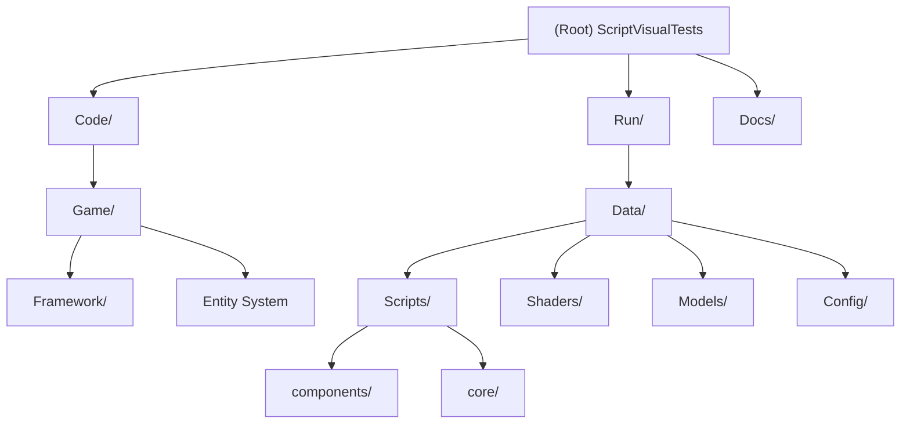

# ScriptVisualTests - Dual-Language Game Engine with V8 Integration

## Changelog

### 2025-10-04 02:35:23
- Initial AI context documentation created
- Project structure and architecture documented
- Module relationships mapped with interactive diagram

---

## Project Vision

ScriptVisualTests (internally named "FirstV8") is a cutting-edge C++ game engine demonstrating advanced dual-language architecture through seamless integration of the **Google V8 JavaScript Engine** with the **DaemonEngine** foundation. This research-grade project showcases how to achieve enterprise-level performance-critical C++ systems while maintaining the flexibility and rapid iteration capabilities of modern JavaScript development.

### Core Innovation

- **Dual-Language Architecture**: C++ for engine performance, JavaScript for game logic flexibility
- **Real-Time Hot Reloading**: JavaScript changes apply instantly without C++ recompilation
- **Chrome DevTools Integration**: Full debugging support for JavaScript game logic via WebSocket
- **ES6 Module System**: Modern JavaScript architecture with Phase 4 pure ES6 modules
- **Component-Based Systems**: Modular game systems using SystemComponent pattern

---

## Architecture Overview

### Technology Stack

- **Language**: C++20, JavaScript ES6
- **Platform**: Windows 10/11 (x64)
- **Build System**: Visual Studio 2022 / MSBuild
- **JavaScript Runtime**: Google V8 Engine v13.0.245.25
- **Graphics API**: DirectX (via DaemonEngine)
- **Audio Engine**: FMOD
- **Physics/Math**: Custom DaemonEngine math library

### System Architecture

```
Windows Application Entry (WinMain)
├── DaemonEngine Foundation (External Submodule)
│   ├── Core Subsystems (C++)
│   ├── Rendering Pipeline (DirectX)
│   ├── Audio Subsystem (FMOD)
│   ├── Input System
│   ├── Resource Management
│   ├── Network/WebSocket (Chrome DevTools)
│   └── Scripting Subsystem (V8 Integration)
├── Game Application Layer (C++)
│   ├── App (Main Loop)
│   ├── Game (State Management)
│   ├── Entity System (Base, Player, Prop)
│   └── GameScriptInterface (C++ ↔ JS Bridge)
└── JavaScript Game Logic (ES6 Modules)
    ├── JSEngine (System Registration Framework)
    ├── JSGame (System Coordinator)
    └── Component Systems (Input, Audio, Spawning, etc.)
```

### Execution Flow

```
C++ Main Loop (App::RunFrame):
├── BeginFrame()
├── Update()
│   └── Game::UpdateJS()
│       └── V8: globalThis.JSEngine.update(gameDelta, systemDelta)
│           ├── CppBridgeSystem → game.update() [C++]
│           ├── AudioSystem
│           ├── InputSystem
│           ├── CubeSpawner
│           ├── PropMover
│           └── CameraShaker
├── Render()
│   └── Game::RenderJS()
│       └── V8: globalThis.JSEngine.render()
│           └── CppBridgeSystem → game.render() [C++]
└── EndFrame()
```

---

## Module Structure Diagram



---

## Module Index

| Module Path | Description | Primary Language | Entry Point |
|-------------|-------------|------------------|-------------|
| [`Code/Game/`](#game-application-module) | Game application executable with C++ entity system | C++ | `Framework/Main_Windows.cpp` |
| [`Code/Game/Framework/`](#framework-subsystem) | Application infrastructure and JS bridge | C++ | `App.cpp` |
| [`Run/Data/Scripts/`](#javascript-runtime-module) | ES6 JavaScript game logic and systems | JavaScript | `main.mjs` |
| [`Run/Data/Scripts/components/`](#component-systems) | Modular game system components | JavaScript | Various `*.mjs` |
| [`Run/Data/Scripts/core/`](#core-javascript-framework) | Core JS infrastructure | JavaScript | `SystemComponent.mjs` |
| [`Run/Data/Shaders/`](#shader-assets) | HLSL rendering shaders | HLSL | - |
| [`Run/Data/Models/`](#3d-assets) | 3D models and textures | Assets | - |
| [`Run/Data/Config/`](#configuration-files) | Runtime configuration | XML/JSON | `GameConfig.xml` |

---

## Running and Development

### Prerequisites

- Visual Studio 2022 with C++ development workload
- Windows 10/11 (x64)
- Git with submodule support
- NuGet Package Manager (included with Visual Studio)

### Quick Start

1. **Clone with Submodules:**
   ```bash
   git clone --recursive <repository-url>
   cd ScriptVisualTests
   git submodule update --init --recursive
   ```

2. **Open Solution:**
   ```bash
   start ScriptVisualTests.sln
   ```

3. **Restore NuGet Packages:**
   - Visual Studio will automatically restore V8 packages
   - V8 packages are installed to: `../Engine/Code/ThirdParty/packages/`

4. **Build Configuration:**
   - Select `Debug|x64` or `Release|x64`
   - Build → Build Solution (Ctrl+Shift+B)
   - Output: `Temporary/ScriptVisualTests_x64_<Config>/`
   - Deployed to: `Run/ScriptVisualTests_<Config>_x64.exe`

5. **Run Application:**
   ```bash
   cd Run
   ScriptVisualTests_Debug_x64.exe
   ```

### Development Workflow

1. **C++ Engine Development**:
   - Edit files in `Code/Game/`
   - Modify `../Engine/Code/Engine/` (external submodule)
   - Rebuild solution to apply changes

2. **JavaScript Game Logic**:
   - Edit files in `Run/Data/Scripts/`
   - Changes apply immediately via hot-reload (no rebuild required)
   - FileWatcher detects changes, ScriptReloader reloads modules

3. **Debugging**:
   - **C++**: Visual Studio debugger (F5)
   - **JavaScript**: Chrome DevTools at `chrome://inspect` (port 9222)
   - Combined: Debug both simultaneously

4. **Asset Management**:
   - Add models to `Run/Data/Models/`
   - Add textures to `Run/Data/Images/`
   - Add shaders to `Run/Data/Shaders/`
   - Add audio to `Run/Data/Audio/`

---

## Testing Strategy

### Current Test Coverage

- **Module System Validation**:
  - Phase 1: ES6 module compilation and evaluation (F8)
  - Phase 2: Import resolution and cross-module dependencies (F9)
  - Phase 3: Dynamic imports, import.meta, error recovery (M key)

- **Runtime Testing**:
  - Input system: F1 (render toggle), Space (game state)
  - Entity spawning: JavaScript cube creation
  - Prop manipulation: JavaScript position updates
  - Camera effects: JavaScript shake system

### Test Entry Points

```cpp
// Game.cpp validation methods
void ValidatePhase1ModuleSystem();  // F8 - Basic module loading
void ValidatePhase2ModuleSystem();  // F9 - Import resolution
void ValidatePhase3ModuleSystem();  // M  - Advanced features
```

### Manual Testing

- **F8**: Test ES6 module compilation
- **F9**: Test import resolution
- **M**: Test dynamic imports
- **F1**: Toggle rendering (JavaScript input system)
- **Space**: ATTRACT → GAME state transition
- **ESC**: Quit application
- **J**: Execute test JavaScript file
- **K**: Move prop via JavaScript
- **L**: Get player position via JavaScript

---

## Coding Standards

### C++ Standards (C++20)

- **Style**: Modern C++20 with conformance mode
- **Naming**:
  - Classes: `PascalCase` (e.g., `GameScriptInterface`)
  - Functions: `PascalCase` (e.g., `ExecuteJavaScriptCommand`)
  - Variables: `camelCase` with `m_` prefix for members (e.g., `m_gameState`)
  - Constants: `UPPER_SNAKE_CASE` (e.g., `KEYCODE_F1`)

- **Memory Management**:
  - Use `GAME_SAFE_RELEASE` macro for cleanup
  - RAII patterns for resource management
  - Smart pointers for V8 integration

- **Error Handling**:
  - `ERROR_AND_DIE` for critical failures
  - `DAEMON_LOG` for structured logging
  - Try-catch for JavaScript execution

### JavaScript Standards (ES6+)

- **Style**: Modern ES6 modules
- **Naming**:
  - Classes: `PascalCase` (e.g., `SystemComponent`)
  - Functions: `camelCase` (e.g., `handleF1Key`)
  - Variables: `camelCase` (e.g., `frameCount`)
  - Constants: `UPPER_SNAKE_CASE` (e.g., `KEYCODE_F1`)

- **Module Organization**:
  - One component per file
  - Explicit imports/exports
  - No `globalThis` pollution (except required bridges)

- **SystemComponent Pattern**:
  ```javascript
  export class MySystem extends SystemComponent {
      constructor() {
          super('mySystem', priority, config);
      }
      update(gameDelta, systemDelta) { /* logic */ }
      render() { /* optional */ }
  }
  ```

### File Organization

- **C++ Headers**: `.hpp` extension
- **C++ Source**: `.cpp` extension
- **JavaScript Modules**: `.mjs` extension
- **Configuration**: `.xml` for game config, `.json` for subsystems

---

## AI Usage Guidelines

### Safe to Modify

✅ **JavaScript Component Systems**:
- `Run/Data/Scripts/components/*.mjs` - Individual game systems
- Add new systems by creating new `.mjs` files
- Register in `JSGame.mjs` constructor

✅ **Game Logic**:
- `Code/Game/Entity.cpp/hpp` - Entity implementations
- `Code/Game/Player.cpp/hpp` - Player behavior
- `Code/Game/Prop.cpp/hpp` - Prop behavior

✅ **Configuration**:
- `Run/Data/GameConfig.xml` - Game settings
- `Run/Data/Config/*.json` - Subsystem configs

### Requires Caution

⚠️ **Core JavaScript Infrastructure**:
- `Run/Data/Scripts/JSEngine.mjs` - System registration framework
- `Run/Data/Scripts/JSGame.mjs` - System coordinator
- `Run/Data/Scripts/core/SystemComponent.mjs` - Base class
- Changes require understanding of full system architecture

⚠️ **C++ Framework**:
- `Code/Game/Framework/App.cpp/hpp` - Main loop
- `Code/Game/Framework/GameScriptInterface.*` - JS bridge
- Changes may break JavaScript integration

### Do NOT Modify

🚫 **Critical Infrastructure**:
- `Code/Game/Framework/Main_Windows.cpp` - Windows entry point
- `Run/Data/Scripts/components/CppBridgeSystem.mjs` - Core bridge
- `../Engine/` - External DaemonEngine submodule
- V8 integration code in `Engine/Scripting/`

### AI Agent Best Practices

1. **Adding New Game Systems**:
   - Create new `.mjs` file in `components/`
   - Extend `SystemComponent` base class
   - Set appropriate priority (0-100, lower = earlier)
   - Register in `JSGame.createComponentInstances()`

2. **Modifying Existing Systems**:
   - Each system is isolated in its own file
   - No conflicts between AI agents editing different systems
   - Hot-reload applies changes without restart

3. **Debugging JavaScript**:
   - Use `console.log()` for debugging
   - Access Chrome DevTools at `chrome://inspect`
   - Check C++ logs via `DAEMON_LOG`

4. **C++ ↔ JavaScript Communication**:
   - C++ exposes methods via `GameScriptInterface`
   - JavaScript calls C++ via `game.*` object
   - Use `ExecuteJavaScriptCommand()` for C++ → JS

---

## External Dependencies

### DaemonEngine (Git Submodule)

- **Location**: `../Engine/` (parent directory)
- **Purpose**: Core game engine foundation
- **Key Subsystems**:
  - Core (Clock, EventSystem, LogSubsystem)
  - Renderer (DirectX, Shader, Texture, Camera)
  - Audio (FMOD integration)
  - Input (Keyboard, Mouse, Xbox Controller)
  - Scripting (V8 integration, ModuleLoader, Chrome DevTools)
  - Resource (Texture, Shader, Model loading)
  - Network (WebSocket for DevTools)

### V8 JavaScript Engine (NuGet)

- **Package**: `v8-v143-x64.13.0.245.25`
- **Redist**: `v8.redist-v143-x64.13.0.245.25`
- **Install Location**: `../Engine/Code/ThirdParty/packages/`
- **Features Used**:
  - ES6 Modules (import/export)
  - Chrome DevTools Protocol
  - Isolate/Context management
  - Module resolution callbacks

### FMOD Audio Engine

- **Location**: `Run/fmod*.dll`
- **Purpose**: Professional audio playback
- **Integration**: Via `AudioSubsystem` in DaemonEngine

### DirectX Graphics

- **API**: DirectX (version managed by DaemonEngine)
- **Shaders**: HLSL (.hlsl files)
- **Integration**: Via `Renderer` in DaemonEngine

---

## Project Configuration

### Build System

- **Solution**: `ScriptVisualTests.sln`
- **Project**: `Code/Game/Game.vcxproj` (ScriptVisualTests)
- **Dependency**: `../Engine/Code/Engine/Engine.vcxproj` (Engine static library)

### Output Directories

- **Intermediate**: `Temporary/<ProjectName>_<Platform>_<Config>/`
- **Final Executable**: `Run/<ProjectName>_<Config>_<Platform>.exe`
- **Working Directory**: `Run/` (for asset access)

### Build Configurations

| Configuration | Platform | Runtime | Optimization | Debug Info |
|---------------|----------|---------|--------------|------------|
| Debug | x64 | MTd | Disabled | Full |
| Release | x64 | MT | O2 | Limited |

### Preprocessor Defines

- `ENGINE_DEBUG_RENDER` - Enable debug rendering
- `WIN32_LEAN_AND_MEAN` - Minimal Windows headers
- `NOMINMAX` - Prevent min/max macro conflicts

---

## Key File Locations

### C++ Source Files

- **Entry Point**: `Code/Game/Framework/Main_Windows.cpp`
- **Main Loop**: `Code/Game/Framework/App.cpp`
- **Game Logic**: `Code/Game/Game.cpp`
- **Entity System**: `Code/Game/Entity.cpp`, `Player.cpp`, `Prop.cpp`
- **JS Bridge**: `Code/Game/Framework/GameScriptInterface.cpp`

### JavaScript Source Files

- **Entry Point**: `Run/Data/Scripts/main.mjs`
- **Engine Framework**: `Run/Data/Scripts/JSEngine.mjs`
- **Game Coordinator**: `Run/Data/Scripts/JSGame.mjs`
- **Core Infrastructure**: `Run/Data/Scripts/core/SystemComponent.mjs`
- **Component Systems**: `Run/Data/Scripts/components/*.mjs`

### Configuration Files

- **Game Config**: `Run/Data/GameConfig.xml`
- **Log Config**: `Run/Data/Config/LogConfig.json`
- **WebSocket Config**: `Run/Data/Config/WebSocketConfig.json`
- **NuGet Config**: `NuGet.config`

### Asset Directories

- **Shaders**: `Run/Data/Shaders/` (HLSL)
- **Models**: `Run/Data/Models/` (OBJ, FBX)
- **Textures**: `Run/Data/Images/` (PNG, TGA)
- **Audio**: `Run/Data/Audio/` (WAV, MP3)
- **Fonts**: `Run/Data/Fonts/` (PNG)

---

## Module Documentation

### Game Application Module

**Location**: `Code/Game/`

See [Code/Game/CLAUDE.md](Code/Game/CLAUDE.md) for detailed documentation.

**Purpose**: Main game application executable with entity system and JavaScript bridge.

**Key Components**:
- Game state management (ATTRACT/GAME modes)
- Entity system (Player, Prop base classes)
- JavaScript integration (execution, hot-reload)
- Input handling (keyboard, controller)
- Camera and rendering coordination

### Framework Subsystem

**Location**: `Code/Game/Framework/`

**Purpose**: Application infrastructure, main loop, and C++ ↔ JavaScript bridge.

**Key Files**:
- `Main_Windows.cpp` - Windows entry point (WinMain)
- `App.cpp/hpp` - Main application loop (Startup, RunFrame, Shutdown)
- `GameScriptInterface.cpp/hpp` - C++ methods exposed to JavaScript
- `GameCommon.cpp/hpp` - Shared definitions and utilities

### JavaScript Runtime Module

**Location**: `Run/Data/Scripts/`

See [Run/Data/Scripts/CLAUDE.md](Run/Data/Scripts/CLAUDE.md) for detailed documentation.

**Purpose**: ES6 JavaScript game logic and system framework.

**Architecture**: Phase 4 Pure ES6 Module pattern
- Single entry point: `main.mjs`
- ES6 imports for dependencies
- SystemComponent pattern for game systems
- Hot-reload support via C++ FileWatcher

### Component Systems

**Location**: `Run/Data/Scripts/components/`

**Purpose**: Modular game system implementations.

**Systems**:
- `CppBridgeSystem.mjs` (Priority 0) - C++ engine bridge
- `AudioSystem.mjs` (Priority 5) - Audio playback
- `InputSystem.mjs` (Priority 10) - Input handling
- `CubeSpawner.mjs` (Priority 20) - Entity spawning
- `PropMover.mjs` (Priority 30) - Prop animation
- `CameraShaker.mjs` (Priority 40) - Camera effects
- `NewFeatureSystem.mjs` - Template for new features

### Core JavaScript Framework

**Location**: `Run/Data/Scripts/core/`

**Purpose**: Core JavaScript infrastructure and base classes.

**Key File**:
- `SystemComponent.mjs` - Abstract base class for all game systems
  - Defines system contract (id, priority, update, render)
  - Provides enable/disable functionality
  - Hot-reload version tracking

### Shader Assets

**Location**: `Run/Data/Shaders/`

**Purpose**: HLSL rendering shaders for DirectX pipeline.

**Shaders**:
- `Default.hlsl` - Basic vertex/pixel shader
- `BlinnPhong.hlsl` - Phong lighting model
- `Bloom.hlsl` - Post-processing bloom effect

### 3D Assets

**Location**: `Run/Data/Models/`

**Purpose**: 3D models and textures for game entities.

**Assets**:
- `Cube/` - Basic cube models (various formats)
- `TutorialBox_Phong/` - Textured box with normals
- `Woman/` - Character model with diffuse/normal maps

### Configuration Files

**Location**: `Run/Data/Config/`

**Purpose**: Runtime configuration for various subsystems.

**Files**:
- `LogConfig.json` - Logging subsystem configuration
- `LogRotation.json` - Log rotation settings
- `WebSocketConfig.json` - Chrome DevTools WebSocket settings

---

## Troubleshooting

### Common Issues

1. **V8 DLLs Not Found**:
   - Ensure NuGet packages restored successfully
   - Check `Run/` directory for `v8*.dll` files
   - Verify PostBuildEvent in `Game.vcxproj` executed

2. **JavaScript Not Loading**:
   - Check working directory is set to `Run/`
   - Verify `Data/Scripts/main.mjs` exists
   - Check C++ logs for ScriptSubsystem initialization errors

3. **Chrome DevTools Not Connecting**:
   - Verify WebSocket port 9222 is open
   - Check `Run/Data/Config/WebSocketConfig.json`
   - Navigate to `chrome://inspect` in Chrome

4. **Hot Reload Not Working**:
   - Ensure FileWatcher is enabled in DaemonEngine
   - Check for JavaScript syntax errors in console
   - Verify ScriptReloader is initialized

---

## Related Resources

- **DaemonEngine Repository**: [GitHub](https://github.com/dadavidtseng/Engine) (External)
- **Google V8 Documentation**: [v8.dev](https://v8.dev/)
- **Chrome DevTools Protocol**: [chromedevtools.github.io](https://chromedevtools.github.io/devtools-protocol/)
- **FMOD API**: [fmod.com/docs](https://www.fmod.com/docs)

---

**Project Status**: Active Research Project
**Version**: 1.0.0-alpha
**Last Updated**: 2025-10-04
**Build Status**: ✅ Passing (Debug/Release x64)
